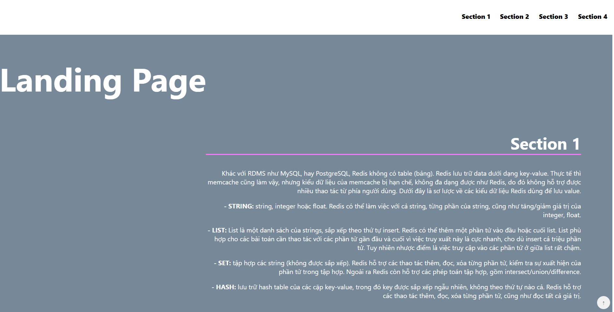

# Landing Page - Project 2

## Table of Contents

- [Instructions](#instructions)
- [Development](#development)
- [Technical](#technologyused)
- [Author](#author)

## Instructions

This is a simple landing page project created using HTML, CSS, and JavaScript.
The landing page is designed to showcase a product, service, or important information in an engaging way.

## Development

Website has some features that :
1: Click on the navigation bar then scroll to the this section on the main
2: Responsive content
3: Button go to top

## Technology used

- `index.html`: The main HTML file for the landing page.
- `styles.css`: The CSS file to customize the page's appearance.
- `script.js`: The JavaScript file to add effects or interactions to the page.

## Author

This project is created by ManhCT. If you have any questions or feedback, please contact [manhct@fpt.com](mailto:manhct@fpt.com).

Best of luck with your project! 🚀
